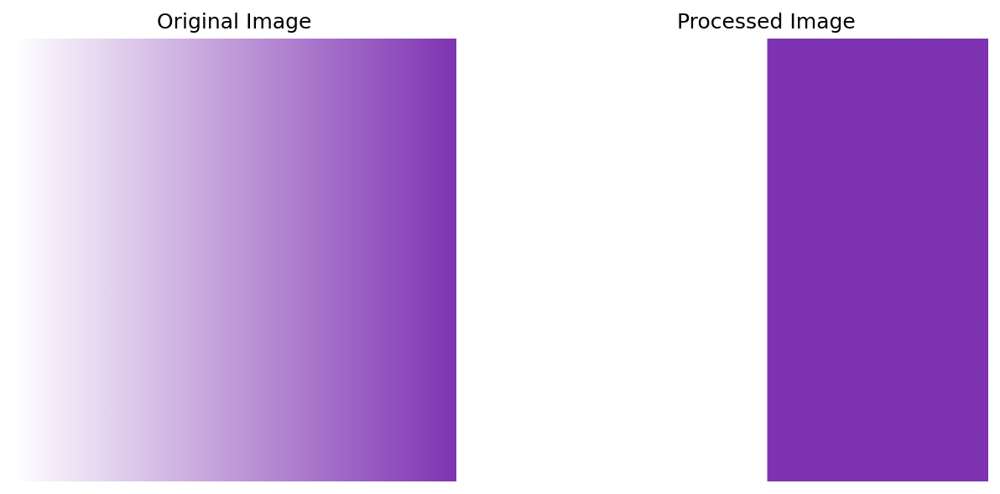

# Image Alpha Channel Processor

A tool for processing image alpha channels with configurable thresholding.

## Features

- Converts translucent pixels to fully transparent or opaque
- Configurable alpha threshold (0-1)
- Preserves original image dimensions and format
- High-resolution output (300 DPI)
- Comprehensive error handling and logging
- Command-line interface with configurable parameters

## Visual Example



**Key differences:**
- Left: Gradient transparency (alpha 0→1)
- Right: Binary transparency (alpha 0 or 1)
- Notice the hard edge where alpha crosses 0.5 threshold

## Installation

1. **Clone repository**
   ```bash
   git clone https://github.com/PFarahani/image-alpha-channel-processor.git
   cd image-alpha-channel-processor
   ```

2. **Install requirements**
   ```bash
   pip install -r requirements.txt
   ```

## Requirements

- Python 3.8+
- numpy
- matplotlib

## Usage

```bash
python script.py input_image.png [options]
```

### Parameters

| Parameter           | Description                                  | Default      |
|---------------------|----------------------------------------------|--------------|
| `input_path`        | Path to input image (RGBA format)            | **Required** |
| `-t`, `--threshold` | Alpha threshold value (0-1)                  | 0.5          |
| `-s`, `--suffix`    | Output filename suffix                       | "_processed" |

### Example

```bash
python script.py images/input.png -t 0.7 -s "_cleaned"
```

This will create:
```
images/input_cleaned.png
```